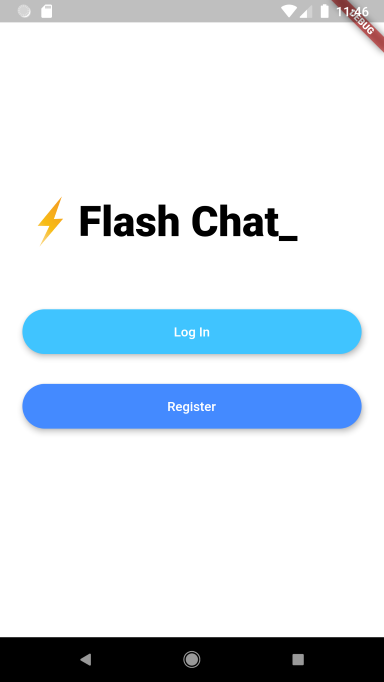
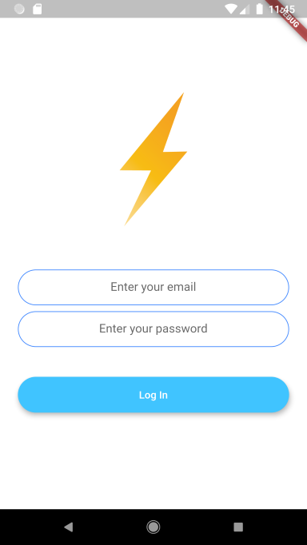
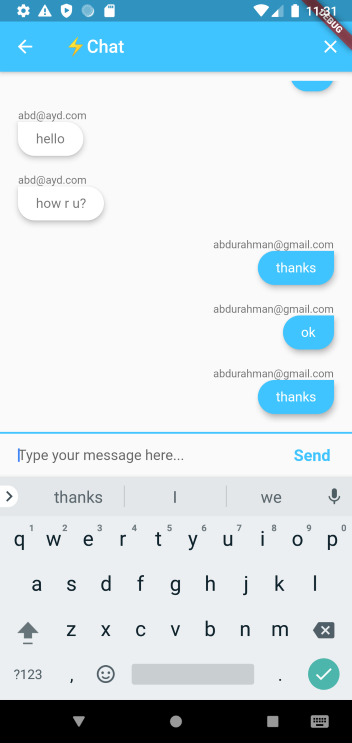

# Flash-Chat-Flutter

## Goal

The objective of this tutorial is to learn how to incorporate Firebase into our Flutter apps. We'll be using Firebase Cloud Firestore as well as the Firebase authentication package to equip our app with a cloud-based NoSQL database and secure authentication methods. 

## SS

## Key concepts shown in this section are

- Incorporate Firebase into your Flutter projects.
- Use Firebase authentication to register and sign in users.
- Create beautiful animations using the Flutter Hero widget.
- Create custom animations using Flutter's animation controller. 
- Mixins and how they differ from superclasses.
- Streams and how they work.
- ListViews to build scrolling views.
- Firebase Cloud Firestore to store and retrieve data on the fly.

